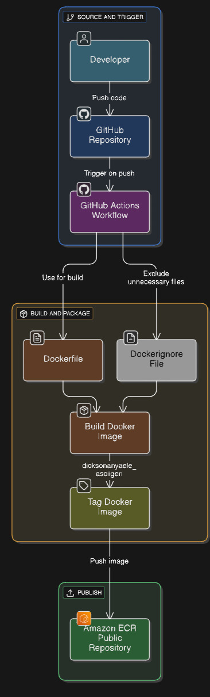

# asciigen

A simple Java-based web application that generates ASCII art from user input.

---

## Overview

**asciigen** converts plain text into stylized ASCII art. built in Java, containerized using Docker, and automatically deployed to [Amazon ECR Public](https://gallery.ecr.aws/elitekaycy/ascii-gen) using a GitHub Actions workflow.

---

## 🧰 Features

- ✍️ Input text and get back ASCII-stylized output
- 🌐 Simple user-friendly web interface
- 🐳 Containerized for easy deployment
- ⚙️ CI/CD with GitHub Actions and AWS ECR Public

---

